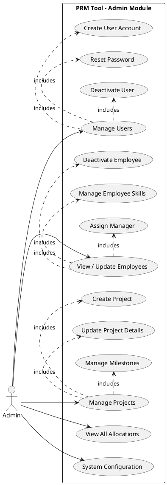
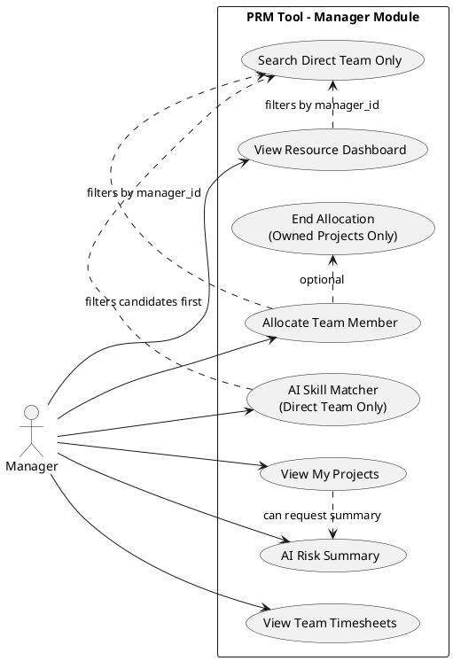
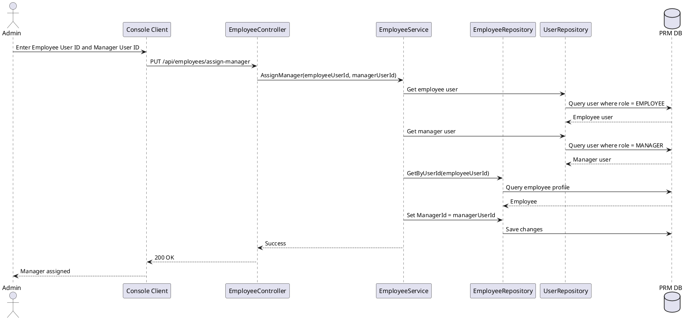
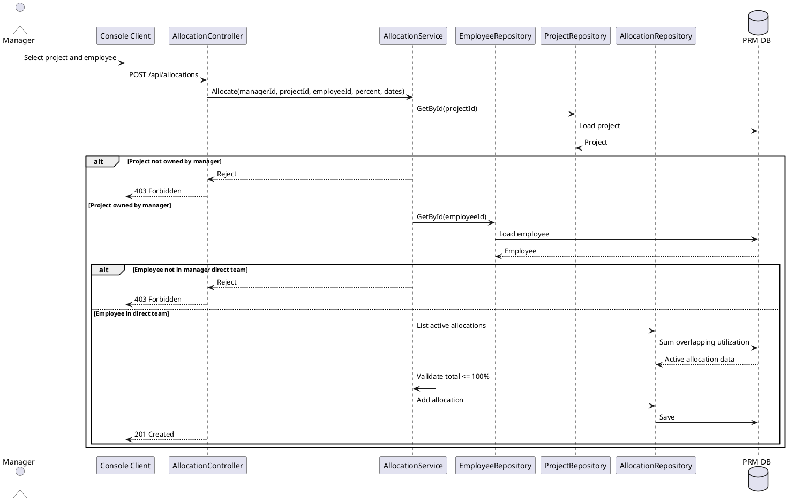
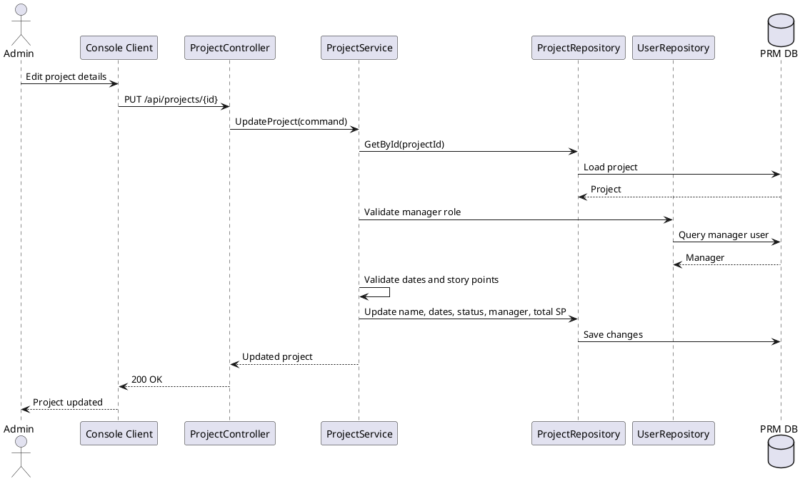
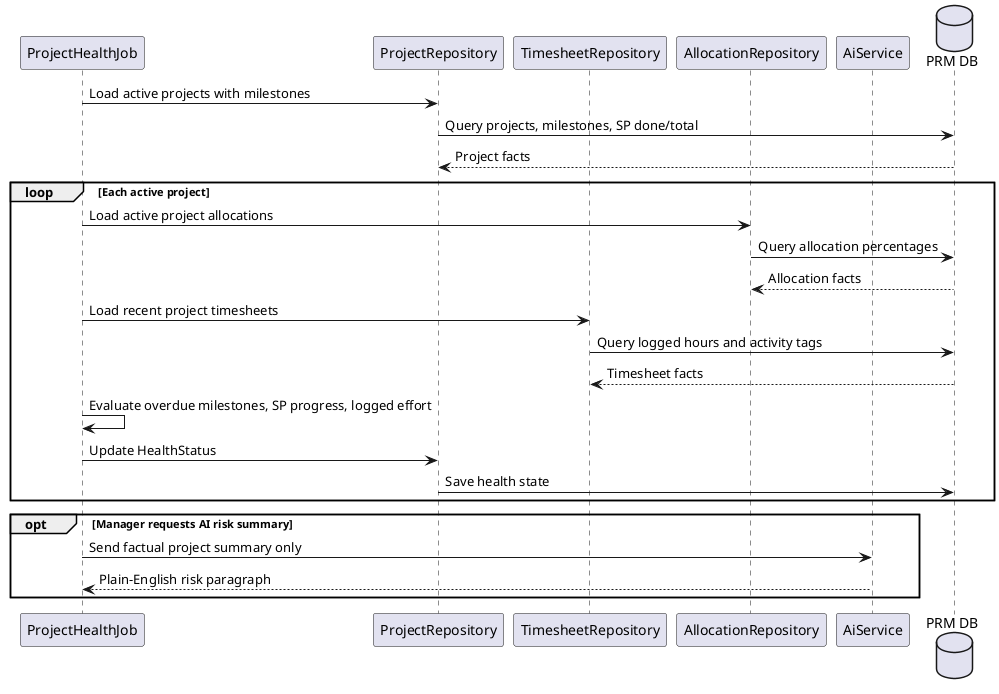
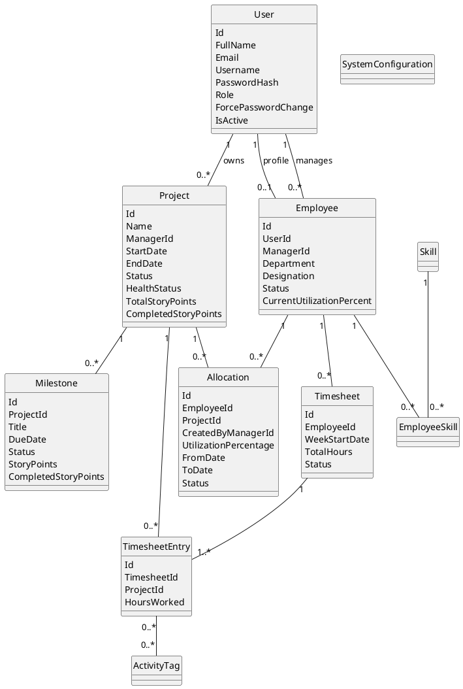

# V4 Diagram Updates

These PlantUML diagrams update the original design document for the V4 BRD changes:

- Employee manager assignment.
- Manager-only direct-team visibility.
- Project story-point tracking.
- Explicit project detail update flow.
- Project health using milestones, story points, allocations, and timesheets.

## 1. Admin Use Case - Updated

## 2. Manager Use Case - Updated Team Scope

## 3. Assign Manager Sequence - New

## 4. Resource Allocation Sequence - Updated Team Scope

## 5. Project Update / Story Points Sequence - New

## 6. Project Health Sequence - Updated Story Points

## 7. Data Model - Updated V4 Core

